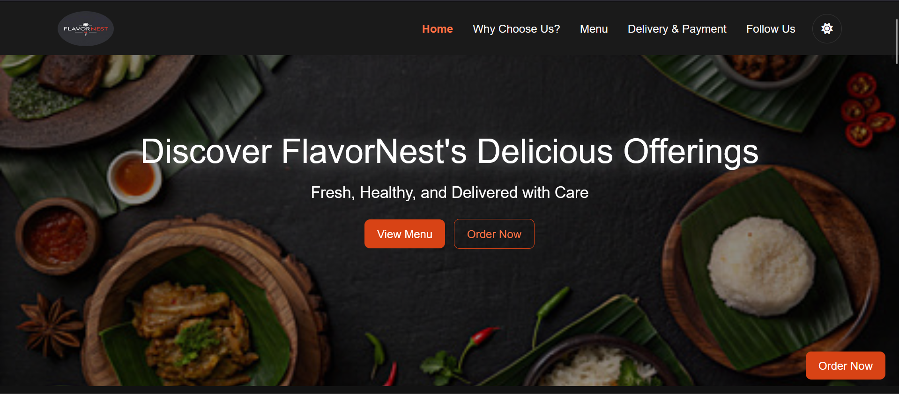
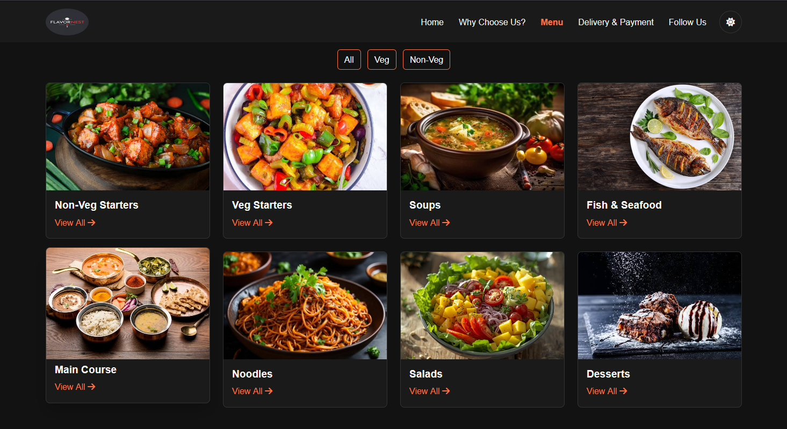
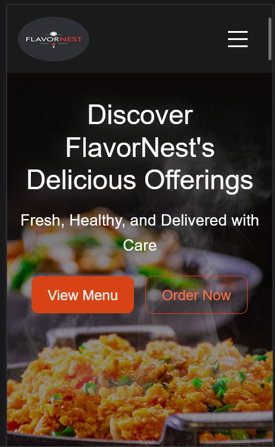

# 🍴 FlavorNest Website


# 🌟 Project Overview


FlavorNest is a responsive restaurant landing page built using HTML, CSS, Bootstrap, and JavaScript.
The project focuses on building a clean UI, consistent styling system, responsive layout, and interactive user experience.

It demonstrates core frontend development concepts including layout design, DOM manipulation, responsive design, animations, and UI micro-interactions. 

---

## 🎯 Why I Built This Project

I built this project while revisiting my web development fundamentals.
The goal was to strengthen my understanding of HTML, CSS, Bootstrap, and JavaScript by creating a responsive restaurant website with interactive UI elements.


## 🚀 Live Demo
🔗 [View Website](https://flavornest-website-ka6a.vercel.app/)  


---

## 🛠️ Tech Stack

| Technology   | Purpose |
|--------------|---------|
| 🌐 **HTML5** | Structure of the website |
| 🎨 **CSS3**  | Styling and responsive design |
| ⚡ **Bootstrap 5** | Layout, components, and responsiveness |
| ✨ **JavaScript (ES6)** | Interactivity (modals, filtering, dark mode) |
|☁️ **Vercel**    | Deployment platform|

---

## ✨ Features

### UI & Layout

- Responsive Navbar with mobile hamburger menu
- Hero banner with call-to-action buttons
- Consistent design system (colors, spacing, typography)

### Interactivity

- Dark / Light Mode Toggle 🌙☀️
-  Active Navbar Highlight while scrolling
- Scroll animations using Intersection Observer
-  Menu filtering (Veg / Non-Veg / All)

### Components

- Order Form Modal
- Video Modal (Healthy Food Section)
- Testimonials Carousel
- Sticky "Order Now" floating button

### Micro-Interactions

- Card hover animations
- Image zoom effects
- Smooth UI transitions

### 📱 Responsive Design

The website is fully responsive and optimized for:

💻 Desktop

📱 Mobile

Bootstrap grid system and custom media queries ensure consistent layout across devices.

---

## 📂 Project Structure
```plaintext
flavornest-website/
│
├── index.html
│
├── css/
│   └── style.css
│
├── js/
│   └── script.js
│
├── images/
│
└── README.md
```


## ⚡ How to Run Locally
1. Clone the repository  
    ```bash
        git clone https://github.com/ybhavanareddy/flavornest-website.git
    ```

2. Open the project folder
    ```bash
       cd flavornest-website
    ```
3. Open index.html in your browser 🚀

## 💡 Key Concepts Implemented

- This project demonstrates several important frontend concepts:

- Semantic HTML structure

- CSS design system using variables

- Responsive layout with Bootstrap grid

- Dark mode implementation

- DOM manipulation with JavaScript

- Event handling

- LocalStorage usage

- Scroll-based animations

- UI micro-interactions

## 📸 Screenshots

### Desktop View




### Mobile View


## 🤝 Contribution

Contributions are welcome!
If you would like to improve the project:

1.Fork the repository

2.Create a new branch

3.Submit a pull request


## 📜 License
This project is licensed under the [MIT License](LICENSE).


### 👩‍💻 Author
 
## Yatham Bhavana

🔗 LinkedIn
 http://www.linkedin.com/in/yatham-bhavana 
